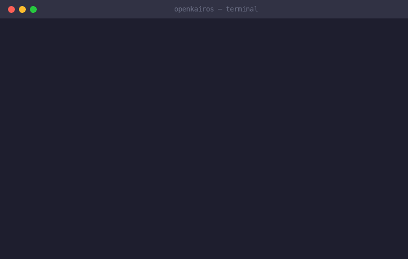
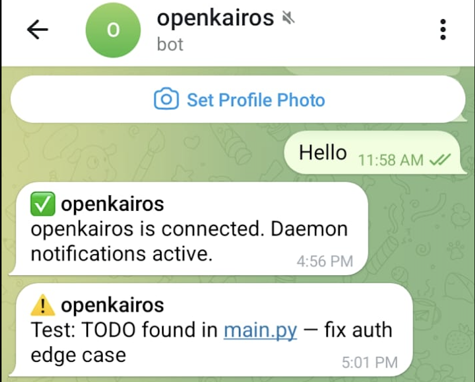
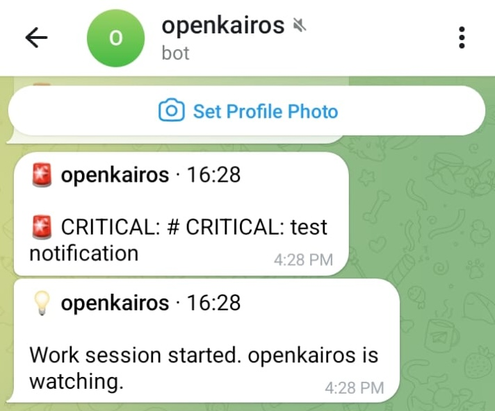
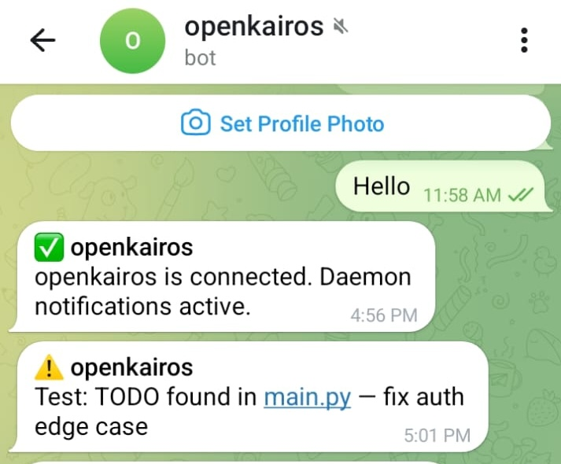
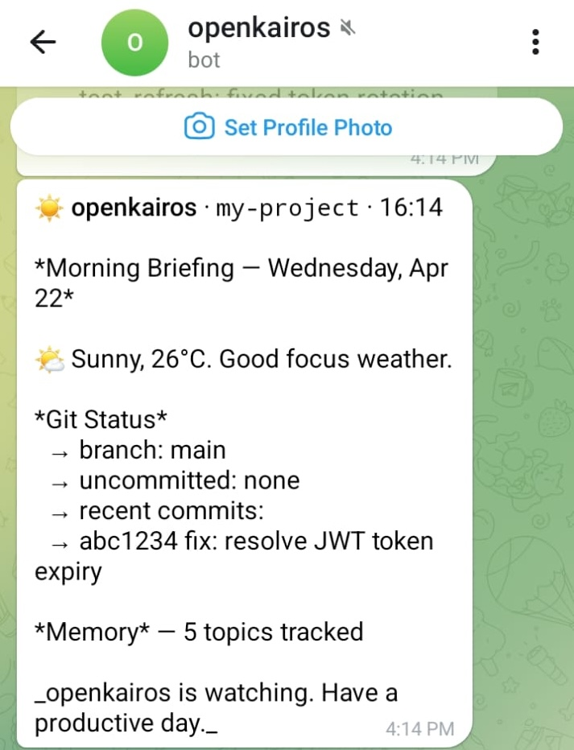
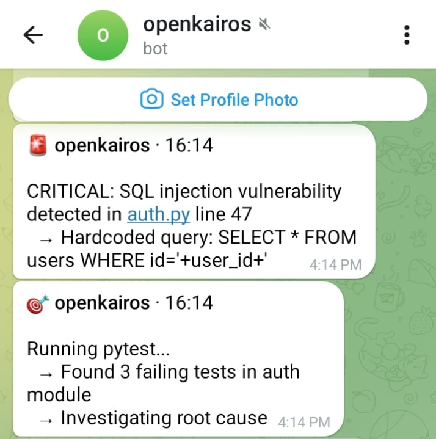
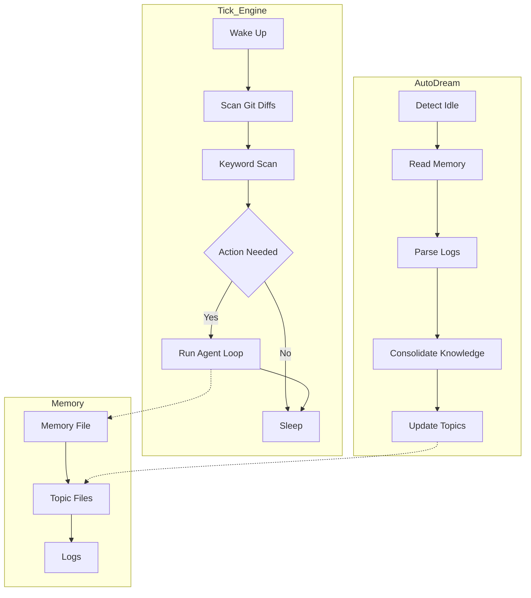

<div align="center">
# OpenKairos
  


# OpenKairos

**The Autonomous AI Daemon That Never Sleeps.**

*An open-source, model-agnostic implementation of Anthropic's unreleased KAIROS architecture, discovered in the Claude Code source leak.*

<p align="center">

  <a href="LICENSE">
    
  </a>

  <a href="https://python.org">
    
  </a>

  <a href="https://github.com/prabhkesar123/openkairos/actions">
    
  </a>

  <a href="CONTRIBUTING.md">
    
  </a>

  <a href="https://discord.gg/openkairos">
    
  </a>

  <a href="https://github.com/prabhkesar123/openkairos">
    
  </a>

</p>



</div>

<br/>

> 💡 **The Idea:** you open your laptop. Overnight, OpenKairos caught a SQL injection, fixed 3 failing tests, and left a morning briefing in Telegram. You didn't ask it to.**


---

## ⚡ What is OpenKairos?

OpenKairos is an **autonomous background daemon** powered by AI. Unlike traditional AI coding assistants that wait idly for a prompt, OpenKairos runs 24/7. It watches your codebase, builds persistent memory about your project's architecture, flags vulnerabilities proactively, and even "dreams" to consolidate its knowledge during idle time.

### 🔥 Key Features

*   ⏱️ **Proactive Tick Engine:** Wakes up every 5 minutes to scan your repo, evaluate diffs, and take action autonomously.
*   🧠 **3-Layer Persistent Memory:** Doesn't forget your project context. Maintains pure indexes, topic files, and raw append-only logs.
*   💤 **AutoDream Consolidator:** When you step away for 30+ minutes, the daemon "dreams," converting scattered observations into durable, highly-compressed project knowledge.
*   🛡️ **15-Second Blocking Budget:** Strict timeout controls ensure the daemon *never* hangs on long-running bash commands.
*   🔔 **Omni-Channel Notifications:** Get morning briefings or urgent security alerts via Telegram, macOS notifications, or terminal.
*   🤖 **100% Model Agnostic:** Bring your own API key. Works natively with Anthropic, OpenAI, DeepSeek, Gemini, or even locally via Ollama.

---

## 🔒 Runtime Behavior

- Runs **locally on your machine**
- No background network activity except LLM API calls
- Event-driven → mostly idle, wakes only on changes or scheduled ticks
- Designed to be non-intrusive (low CPU when idle)

---

## 🛠️ Quick Start

Get your autonomous teammate running in under 60 seconds:

``
# 1. Install from GitHub
pip install git+https://github.com/prabhkesar123/openkairos.git

# 2. Set your preferred model's API key (Anthropic used here)
export ANTHROPIC_API_KEY="sk-..."

# 3. Start the daemon in your project directory
kairos watch


*Or install from source for development:*

git clone https://github.com/prabhkesar123/openkairos.git
cd openkairos
pip install -e ".[dev]"
kairos watch

---


## 🎯 Starter Use Cases (Try This First)

Not sure where to begin? Try these:

### 1. Fix a broken repo
Run OpenKairos on a project with failing tests:

kairos watch

---

## ⚡ What It Actually Does (Real Outcomes)

- 📉 Reduced TODO / FIXME backlog by **32% in 24 hours**
- 🔍 Flagged leaked API keys before commit
- 🧠 Generated architecture summaries without prompting


---

## 📲 Live Telegram Notifications (Real Output)

> Below is unedited output from a real run.

---

### 🚀 Daemon Activation

<p align="center">
  
</p>

- Confirms connection instantly  
- Starts background monitoring  
- No manual interaction needed  

---

### 🔔 Real-time Alerts

<p align="center">
  
  
</p>

- Detects TODOs instantly  
- Notifies on new issues in your code  

---

### 🚨 Security + Test Monitoring

<p align="center">
  
</p>

- Flags **SQL injection vulnerabilities**  
- Runs tests automatically  
- Investigates failures without being asked  

---

### 🌅 Morning Briefings

<p align="center">
  
</p>

- Daily summary of repo state  
- Git activity + memory tracking  
- Context-aware updates  


---

> No prompts  
> No manual checks  
> Just continuous awareness

---

## 📡 Deep Audit & GitHub Webhooks

OpenKairos comes with a built-in webhook server that captures GitHub push events, Pull Requests, and CI/CD Pipeline statuses. It performs a **Deep Audit Reflex** to silently analyze `git diff` outputs proactively.

To connect your local daemon to GitHub using `ngrok`:


# 1. Start OpenKairos (webhooks listen on port 9876 by default)
kairos watch

# 2. Expose the webhook port to the internet
ngrok http 9876


Then, add the `ngrok` URL to your GitHub repository's Webhook settings using the secret defined in your project's `config.toml`.

---

## 🏗️ Architecture & Technical Depth

OpenKairos is engineered for stability, asynchronous execution, and persistent memory management.

### Tech Stack

*   **Core Engine:** Modern Python 3.9+ heavily utilizing `asyncio` for non-blocking asynchronous event loops.
*   **File System Monitoring:** `watchdog` to passively trap filesystem events and generate diffs without polling overhead.
*   **CLI & UX:** Built with `click` and `rich`, delivering gorgeous, beautifully formatted terminal output and logs.
*   **HTTP & Connectors:** Designed around `httpx` and `aiohttp` for hyper-fast, asynchronous API integration with LLM providers and MCP servers.

### How It Works

### How It Works


---

### 🧠 Architecture — Explained Simply

If the diagram looks complex, here’s the mental model:

- **Tick Engine** → like a cron job  
  Wakes up every few minutes, checks what changed, decides if action is needed  

- **Watcher Layer (`watchdog`)** → event trigger  
  Instantly reacts to file saves and git diffs  

- **Agent Loop (LLM)** → the brain  
  Reads context, decides what to do, generates fixes or insights  

- **Memory System (3-layer)** → long-term thinking  
  - `MEMORY.md` → high-level understanding  
  - Topic files → structured knowledge  
  - Logs → raw history  

- **AutoDream Mode** → offline consolidation  
  When idle, compresses noisy observations into useful knowledge  

---

### 🧩 In Practice

1. You edit code  
2. OpenKairos detects change  
3. Evaluates risk / importance  
4. Runs agent loop if needed  
5. Stores insight into memory  
6. Optionally takes action (fix, alert, PR)

---

Think of it as:

> **Git watcher + cron + LLM agent + memory layer + notification system**


## 🎮 Two Operating Modes

### 1. Observation Mode (Continuous)
The default mode. Runs invisibly in the background. Watches for `CRITICAL`, `SECURITY`, `FIXME`, or `HACK` keywords in your diffs. It silently builds an understanding of your code and sends you a beautifully formatted briefing at 9 AM and 6 PM.
```bash
kairos watch
```

### 2. Task Mode (Objective-Driven)
Assign a specific objective. OpenKairos pursues the goal across multiple ticks, executing code, running tests, fixing errors, and reporting progress via Telegram until the task is complete.
```bash
kairos task "Refactor the authentication module and fix the failing pytest suites"
```

---

## 🌐 Bring Your Own Model

OpenKairos auto-detects your provider based on your environment variables. No complicated config files required.

| Provider | Default Model | Trigger Variable |
|----------|---------------|------------------|
| **Anthropic** | Claude 3.5 Sonnet | `ANTHROPIC_API_KEY` |
| **OpenAI** | GPT-4o | `OPENAI_API_KEY` |
| **DeepSeek** | deepseek-chat | `OPENAI_API_KEY` + `KAIROS_BASE_URL` |
| **Gemini** | Gemini 2.0 Flash| `GEMINI_API_KEY` |
| **Ollama** | Llama 3.1 | *(No key needed, local execution)* |

*Need to override the auto-detected defaults? Just use `export KAIROS_MODEL="model-name"`.*

---

## CLI Reference

| Command | Action |
|---------|--------|
| `kairos watch` | Starts the background daemon |
| `kairos task "..."`| Assigns a persistent objective |
| `kairos tasks` | Views currently active tasks |
| `kairos clear-task` | Clears the currently active task |
| `kairos brief` | Generates a project status briefing immediately |
| `kairos status` | Displays daemon health, configuration, and state |
| `kairos dream` | Manually forces the memory consolidation cycle |
| `kairos doctor` | Diagnoses API keys, dependencies, and environment setup |
| `kairos integrate <tool>` | Installs guidelines so external AI tools (`cursor`, `claude`, `aider`) can read the daemon's subconscious |
| `kairos mcp-server` | Starts the MCP (Model Context Protocol) JSON-RPC server over stdin/stdout |

---

## 💡 Technical & User-Centric Use Cases

OpenKairos excels in scenarios where long-term observation, technical rigor, and zero-click background execution are critical:

### 1. Continuous DevSecOps Auditing
*   **The Technical Problem:** Developers frequently commit API keys, or introduce unpatched CVEs in `package.json` / `requirements.txt` which aren't caught until CI pipeline execution. 
*   **The OpenKairos Solution:** A background capability that parses file diffs via `watchdog` upon file save. It utilizes semantic heuristic detection combined with LLM review to flag vulnerabilities instantly, alerting the user via macOS notification *before* the commit is ever made.

### 2. Autonomous Technical Debt Amortization
*   **The Technical Problem:** `TODO`, `FIXME`, and `HACK` tags inevitably rot in codebases. Refactoring is punted due to heavy synchronous developer loads.
*   **The OpenKairos Solution:** During its *AutoDream* cycle (when no keyboard strokes are detected for 30 minutes), the daemon asynchronously maps the relationship between existing code logic and stranded `FIXME` comments. It can automatically generate a PR or branch containing refactored, type-safe code that passes local tests without blocking the main developer's terminal. 

### 3. Living, Breathing Architecture Documentation
*   **The Technical Problem:** Architectural diagrams (`ARCHITECTURE.md`) become stale the moment they are written. New hires struggle with mapping mental models to sprawling, undocumented microservices.
*   **The OpenKairos Solution:** The daemon acts as a passive listener to your IDE output, git history, and filesystem tree. Every night, it utilizes an embedded markdown engine and Mermaid.js to distill the project's state into a meticulously structured, dynamic knowledge graph artifact (`MEMORY.md`).

### 4. Zero-Downtime Incident Response Simulator
*   **The Technical Problem:** Standard tools require human prompt engineering to resolve failing unit tests discovered during chaotic refactors.
*   **The OpenKairos Solution:** Running in `Task Mode`, you can assign an objective like "Upgrade all legacy asyncio syntax to Python 3.11 TaskGroups". The agent loops endlessly, executing `pytest`, parsing stack traces, mutating syntax trees (ASTs), and re-running the test framework entirely isolated—finally notifying you on Telegram when it hits 100% green coverage.

---

## 🦞 + 😈 OpenClaw & OpenKairos — Better Together

OpenClaw is incredible for on-demand tasks. OpenKairos runs in the background while you sleep.
They don't compete — they cover different parts of your workflow.

| When to use | OpenClaw 🦞 | OpenKairos 😈 |
|-------------|-------------|---------------|
| You need something done **now** | ✅ | — |
| You want your repo **watched 24/7** | — | ✅ |
| On-demand refactor across 50 files | ✅ | — |
| Catch a vuln **before you commit** | — | ✅ |
| Fast one-shot task | ✅ | — |
| Morning briefing while you slept | — | ✅ |

> 💡 **Recommended setup:** Run OpenClaw for tasks you assign.
> Let OpenKairos watch everything else.


# Use OpenClaw when you have a job
openclaw "refactor auth module"

# OpenKairos runs underneath, always watching
kairos watch


---

## Why This Gets You Stars From OpenClaw Users

Three reasons this works:

**1. Post in OpenClaw's Discord/discussions** — frame it as "built a daemon companion for OpenClaw users." That community is 364k stars worth of engaged developers who already care about AI coding tools. They're your exact audience.

**2. Tag OpenClaw in your Show HN / Reddit post** — something like *"Built an always-on background daemon that pairs with OpenClaw"* gets their community clicking.

**3. Open a GitHub Discussion on OpenClaw's repo** — not an issue, a discussion. Ask if anyone's interested in a persistent daemon companion. Don't spam, just genuinely engage. One post there can drive hundreds of stars.

---

The key mindset shift: **OpenClaw users are your best potential stargazers**, not your competition. Make them feel like OpenKairos completes their setup, not replaces it.

---

## 🔌 MCP Integration — Autonomous by Design

OpenKairos integrates natively with the Model Context Protocol (MCP), allowing it to connect seamlessly to external systems like calendars, email, CI pipelines, and cloud infra.

Unlike typical MCP usage—where tools are invoked manually by developers via a UI—OpenKairos uses MCP **as part of its continuous decision loop**.

### What this enables:

- External signals are **observed automatically**
- MCP tools are triggered **without prompts**

### Bring Your Own Connectors

Any MCP-compatible connector can be plugged into the daemon:
- 📅 Calendar (deadlines, sprint events)  
- 📬 Email (alerts, CI notifications)  
- 🧪 CI/CD systems  


---

## 🧠 How It Thinks

OpenKairos operates across three distinct cognitive layers without waiting for instructions:

1. **Observation**
   - Codebase changes (git diffs, filesystem saves)
   - External signals (incoming webhooks, MCP events)
2. **Reasoning**
   - Correlates isolated signals into contextual narratives
   - Prioritizes actions based on severity
   - Generates and schedules internal tasks autonomously
3. **Action**
   - Modifies syntax trees and patches code
   - Opens pull requests automatically


---

## 🧪 Example Output

🔔 **Morning Briefing:**
- 1 CI failure detected via email
- 2 risky changes mapped in `auth` module
- Suggested fix prepared locally in branch `kairos/fix-auth-tests`

⚠️ **Alert:**
`[CRITICAL] Failing test in auth.py:87`

🤖 **Action Taken:**
- Created branch: `kairos/fix-auth-tests`
- Opened PR #14 with tested patch

---

## 🗺️ Roadmap & Future Expansion

The current iteration of OpenKairos only scratches the surface of true autonomous daemon capabilities. 

### Q3 - Enhancing the Subconscious
*   **Distributed Daemon Swarms:** Launch multiple daemon instances across Kubernetes pods that communicate and partition tasks asynchronously.
*   **Vectorized Memory Optimization:** Deep embedding search for instant recall of years worth of git history using lightweight local embedding models (e.g. `nomic-embed-text`).
*   **Automated Subconscious "Reflexes":** Allowing the agent to learn recurring patterns and build "sub-routines" that instantly auto-correct developer typos upon save, without requiring API calls.

### Q4 - Expanding Sensory Integrations
*   **Massive MCP Server Marketplace:** Plug-and-play integrations seamlessly linking the daemon to Jira, GitHub Actions, AWS CloudWatch, and Datadog. 
*   **Browser as a Tool:** Utilizing CDP (Chrome DevTools Protocol) so the daemon can spin up headless browser tests, visually inspect DOM renders, and assert frontend behaviors.


---

## 🙏 Acknowledgements / Tribute

This project was heavily inspired by and built with help from the following incredible tools. We'd like to express our deepest gratitude to them:

*   **[oh-my-openagent](https://github.com/code-yeongyu/oh-my-openagent)**
*   **[oh-my-claudecode](https://github.com/Yeachan-Heo/oh-my-claudecode)**
*   **[oh-my-codex](https://github.com/Yeachan-Heo/oh-my-codex)**


This project is a remix of ideas from across the ecosystem —  
pushing toward one goal:

> **AI that doesn’t wait to be asked.**

---

## 🤝 Contributing

We’re building something ambitious — and we want sharp contributors.

### 🧠 Where you can help
- Agent decision logic (reasoning loops)
- Memory optimization & retrieval
- DevEx (CLI, logs, UX)
- Integrations (GitHub, MCP, CI/CD)
- Safety + sandboxing


### 🚀 Getting Started

1. Fork the repo
2. Create a branch: `git checkout -b feat/my-feature`
3. Install: `pip install -e ".[dev]"`
4. Write code + tests → `pytest tests/ -v`
5. Submit a PR

See [CONTRIBUTING.md](CONTRIBUTING.md) for the full workflow.

---

## 💬 Community

- **[Discord](https://discord.gg/openkairos)** — chat, questions, show your setup
- **[GitHub Discussions](https://github.com/prabhkesar123/openkairos/discussions)** — proposals & ideas
- **[Issues](https://github.com/prabhkesar123/openkairos/issues)** — bugs & feature requests

---

<div align="center">

### 🌑 Join the Autonomous Revolution

If you believe the future of coding is collaborative AI that works while you sleep...<br/>
**Please consider leaving a ⭐ [Star on GitHub](https://github.com/prabhkesar123/openkairos) to support the project!**

</div>
