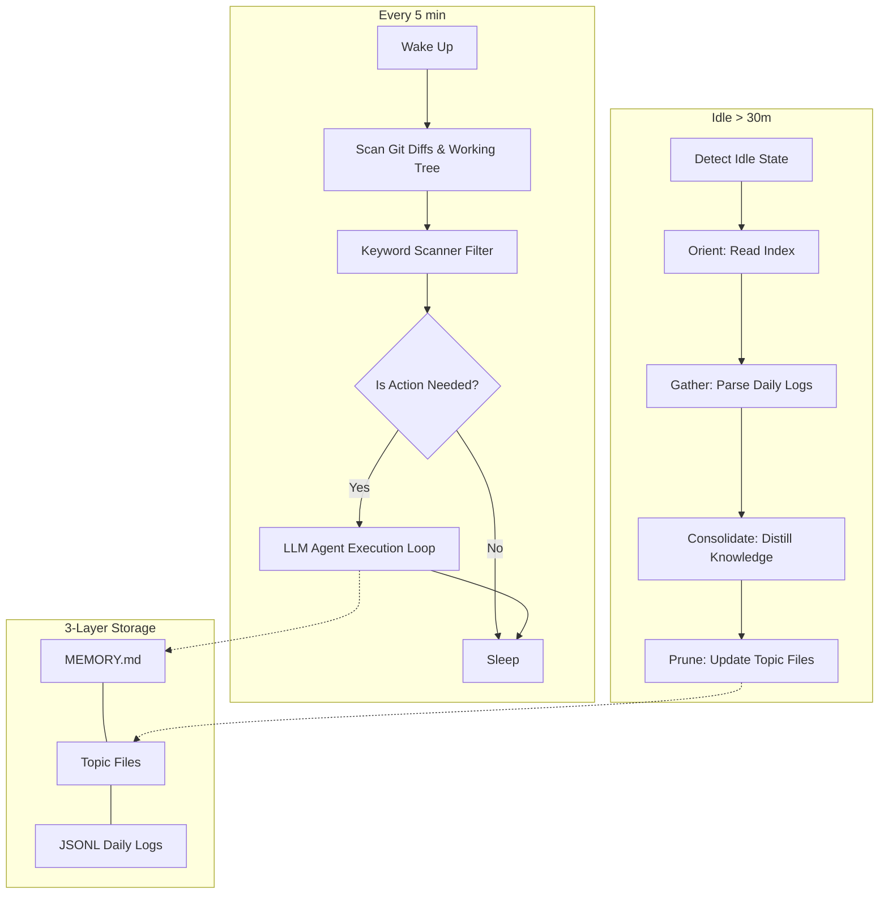

<div align="center">


# OpenKairos

**The Autonomous AI Daemon That Never Sleeps.**

*An open-source, model-agnostic implementation of Anthropic's unreleased KAIROS architecture, discovered in the Claude Code source leak.*

[](LICENSE)
[](https://python.org)
[](#)
[](CONTRIBUTING.md)
[](https://github.com/openkairos/openkairos)

</div>

<br/>

> 💡 **The Paradigm Shift:** We are entering a new epoch in software engineering. The era of reactive, session-bound AI assistants is ending. The age of **always-on, proactive AI daemons** has begun.

---

## ⚡ What is OpenKairos?

OpenKairos is an **autonomous background daemon** powered by AI. Unlike traditional AI coding assistants that wait idly for a prompt, OpenKairos runs 24/7. It watches your codebase, builds persistent memory about your project's architecture, flags vulnerabilities proactively, and even "dreams" to consolidate its knowledge during idle time.

**It's not a chatbot. It's an autonomous teammate.**

### 🔥 Key Features

*   ⏱️ **Proactive Tick Engine:** Wakes up every 5 minutes to scan your repo, evaluate diffs, and take action autonomously.
*   🧠 **3-Layer Persistent Memory:** Doesn't forget your project context. Maintains pure indexes, topic files, and raw append-only logs.
*   💤 **AutoDream Consolidator:** When you step away for 30+ minutes, the daemon "dreams," converting scattered observations into durable, highly-compressed project knowledge.
*   🛡️ **15-Second Blocking Budget:** Strict timeout controls ensure the daemon *never* hangs on long-running bash commands.
*   🔔 **Omni-Channel Notifications:** Get morning briefings or urgent security alerts via Telegram, macOS notifications, or terminal.
*   🤖 **100% Model Agnostic:** Bring your own API key. Works natively with Anthropic, OpenAI, DeepSeek, Gemini, or even locally via Ollama.

---

## 🛠️ Quick Start

Get your autonomous teammate running in under 60 seconds:

```bash
# 1. Install via pip
pip install openkairos

# 2. Set your preferred model's API key (Anthropic used here)
export ANTHROPIC_API_KEY="sk-..."

# 3. Start the daemon in your project directory
kairos watch
```

*Want it fully isolated? Run it in Docker:*
```bash
docker run -v $(pwd):/project -e ANTHROPIC_API_KEY=sk-... ghcr.io/openkairos/openkairos watch /project
```

---

## 🏗️ Architecture: How It Works

OpenKairos utilizes an advanced event loop and memory architecture based on leaked "KAIROS" internals.



---

## 🎮 Two Operating Modes

### 1. Observation Mode (Continuous)
The default mode. Runs invisibly in the background. Watches for `CRITICAL`, `SECURITY`, `FIXME`, or `HACK` keywords in your diffs. It silently builds an understanding of your code and sends you a beautifully formatted briefing at 9 AM and 6 PM.
```bash
kairos watch
```

### 2. Task Mode (Objective-Driven)
Assign a specific objective. OpenKairos pursues the goal across multiple ticks, executing code, running tests, fixing errors, and reporting progress via Telegram until the task is complete.
```bash
kairos task "Refactor the authentication module and fix the failing pytest suites"
```

---

## 🌐 Bring Your Own Model

OpenKairos auto-detects your provider based on your environment variables. No complicated config files required.

| Provider | Default Model | Trigger Variable |
|----------|---------------|------------------|
| **Anthropic** | Claude 3.5 Sonnet | `ANTHROPIC_API_KEY` |
| **OpenAI** | GPT-4o | `OPENAI_API_KEY` |
| **DeepSeek** | deepseek-chat | `OPENAI_API_KEY` + `KAIROS_BASE_URL` |
| **Gemini** | Gemini 2.0 Flash| `GEMINI_API_KEY` |
| **Ollama** | Llama 3.1 | *(No key needed, local execution)* |

*Need to override the auto-detected defaults? Just use `export KAIROS_MODEL="model-name"`.*

---

## CLI Reference

| Command | Action |
|---------|--------|
| `kairos watch` | Starts the background daemon |
| `kairos task "..."`| Assigns a persistent objective |
| `kairos tasks` | Views currently active tasks |
| `kairos brief` | Generates a project status briefing immediately |
| `kairos status` | Displays daemon health, configuration, and state |
| `kairos dream` | Manually forces the memory consolidation cycle |
| `kairos doctor` | Diagnoses API keys, dependencies, and environment setup|

---

## 🌟 Why OpenKairos over Standard Chatbots?

Tools like standard IDE plugins or web chats rely on *ephemeral, reactive* models. Once the tab closes, the context dies. They require you to perfectly engineer a prompt every time.

**OpenKairos represents stateful permanence.** Because it lives inside your environment alongside your bash terminal and git tree, it tracks the *evolution* of your project over weeks and months. You don't manage it—you coordinate with it. 

---

## 🤝 Contributing

We are building the future of asynchronous development. We'd love your help.

1. Fork the repo.
2. `pip install -e ".[dev]"`
3. Add a feature, write tests (`pytest tests/ -v`), and submit a PR.

See our [CONTRIBUTING.md](CONTRIBUTING.md) for full details.

---

<div align="center">

### 🌑 Join the Autonomous Revolution

If you believe the future of coding is collaborative AI that works while you sleep...<br/>
**Please consider leaving a ⭐ [Star on GitHub](https://github.com/openkairos/openkairos) to support the project!**

</div>
